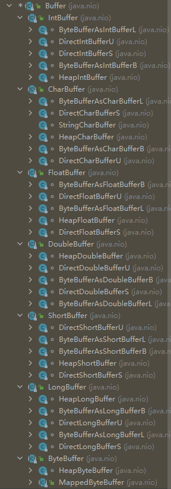

### :sleeping: Netty

## 1 Netty 介绍

1. Netty是由JBOSS提供的一个Java开源框架，现为Github上的独立项目
2. Netty是**异步**的，基于事件驱动的网络应用框架(图见 图解N-1)，用于**快速开发高性能，高可靠性**的**网络IO**程序
3. Netty主要针对在**TCP协议**下，面向**Clients端的高并发**应用，或Peer to Peer场景下的**大量数据持续传输**的应用
4. Netty本质是一个NIO框架，适用于**服务器通讯相关的多种应用**场景
5. 要透彻理解Netty需要先学习NIO，这样我们才能阅读Netty的源码

## 2 Netty的应用场景 

1. 在**分布式系统**中，各个**节点之间**需要远程服务调用，**高性能的RPC框架**必不可少，Netty作为**异步高性能的通信框架**，往往**作为基础的通信组件被RPC框架使用**
2. 典型应用 阿里分布式服务框架Dubbo的RPC框架使用Dubbo协议进行节点通信，dubbo协议默认使用Netty作为基础通信组件,用于实现各进程节点之间的内部通信

## 3 IO模型

1. IO模型简单的理解：使用什么样的管道进行数据的发送和接收，很大程度上决定看程序通信的性能

2. Java共支持3种网络编程模型/IO模式：BIO，NIO，AIO

   | IO模型          | IO模型解释                                                   | 适用场景                                                     |
   | --------------- | ------------------------------------------------------------ | ------------------------------------------------------------ |
   | Java BIO        | 同步并阻塞(传统阻塞型),服务器实现模式为一个连接一个线程，即客户端有连接请求时服务器端就需启动一个线程进行处理，如这个连接不做任何事情会造成不必要的线程开销(图见 图解N-2) | BIO方式适用于连接数目比较小且固定的架构，这种方式对服务器资源要求比较高，并发局限于应用中，JDK1.4以前的唯一选择，但程序简单易理解 |
   | Java NIO        | 同步非堵塞，服务器实现模式为一个线程处理多个请求(连接),即客户端发送连接请求都会注册到多路复用器上，多路复用器轮询到连接有I/O请求就进行处理(图见 图解N-3) | BIO方式适用于**连接数目多且连接较短(轻操作)**的架构,比如聊天服务器，弹幕系统，服务器间通讯等。JDK1.4开始支持，编程较为复杂 |
   | Java AIO(NIO.2) | 异步非堵塞，AIO引入异步通道的概念，采用了Proactor模式，简化了程序编写，有效的请求才启动线程，它的特点是先由操作系统完成后才通知服务端线程启动线程去处理，一般适用于连接数较多且连接时间较长的应用,但未广泛使用 | AIO方式适用于**连接数目较多且连接数目较长(重操作)**的架构，比如相册服务器，充分调用OS参与办法操作，编程较为复杂，JDK7开始支持 |

## 4 Java BIO

### Java BIO 介绍

1. Java BIO 就是**传统的Java io 编程**，其相关的类和接口在Java.io中
2. BIO(blocking I/O) **同步阻塞**，服务器实现模式为一个连接一个线程，即客户端有连接请求时服务器端就需启动一个线程进行处理，如这个连接不做任何事情会造成不必要的线程开销,可通过线程池机制改善(实现多客户连接服务器)
3. BIO方式适用于连接数目比较小且固定的架构，这种方式对服务器资源要求比较高，并发局限于应用中，JDK1.4以前的唯一选择，但程序简单易理解

### Java BIO 工作机制 编程简单流程

1. 服务器启动ServerSocketfasf
2. 客户端启动Socket对服务器进行通信，默认情况下服务器端需要对每个客户建立一个线程与之通讯
3. 客户端发出请求后，会先咨询服务器是否有线程响应，如没有则等待或被拒绝(超过处理的连接数时被拒绝)
4. 如有响应，客户端线程会等待请求结束后，在继续执行

### Java BIO 实例

> - 代码详见demo_day1
> - telnet无法使用
>   - windows键 进入 设置 找到应用(卸载,默认应用,可选功能) 进入 找到相关设置 [程序和功能] 进入 找到 启动或关闭Windows功能 进入 勾上并启用telnet

### Java BIO 问题分析

1. 每个请求都需要创建独立的线程，与对应的客户端进行数据read，业务处理，数据write
2. 当并发数较大时，需**创建大量线程来处理连接**，系统资源占用较大
3. 连接建立后，如当前线程暂无数据可读则线程阻塞在read操作上，造成线程资源浪费

## 5 Java NIO

### java NIO 基本介绍

1. Java NIO 全称Java non-blocking IO，是指JDK提供的新API 从JDK1.4开始，Java提供了一系列改进的输入/输出的新特性，被统称为NIO即New IO，是**同步非阻塞**的
2. NIO相关类被放在java.nio包及子包下，并且对原java.io包中的很多类进行了改写
3. NIO的核心共三部分：**Channel(通道),Buffer(缓冲区),Selector(选择器)**
4. NIO是面对缓冲区或者面向块编程的，数据读取到一个它稍后处理的缓冲区，需要时可在缓冲区中前后移动，这就增加了处理过程中的灵活性，使用它可以提供非阻塞式的高伸缩网络 
5. Java NIO的非阻塞模式，使一个线程从某通道发送请求或读取数据，但它仅能得到目前可用的数据，如果目前没有数据可用时，就什么都不会获取，而不是保持**线程堵塞**，所以直至数据变的可以读取之前，该线程可继续做其他的事情，非阻塞写也是如此，一个线程请求写入一些数据到某通道，但不需要等待它完全写入，这个线程同时可以去做别的事情
6. NIO可以做到用一个线程来处理多个操作的，假设有1W个请求过来，会根据实际情况对线程继续分配，可能50个也可能100个线程来处理，不会像之前的阻塞IO那样，非得分配1W个
7. HTTP2.0使用了多路复用的技术，可以做到同一个连接并发处理多个请求，而且并发请求的数量比HTTP1.1大好几个数量级

### java NIO Buffer的使用

-  代码详见demo_day1

### java NIO NIO与BIO的区别

1. BIO以流的方式处理数据，而NIO以块的方式处理数据，块I/O的效率比流I/O高很多
2. BIO为阻塞的，NIO为非阻塞的
3. BIO基于字节流和字符流进行操作，而NIO基于Channel(管道)和Buffer(缓冲区)进行操作，数据总是从管道读取到缓冲区中，或从缓冲区写入管道。Selector(选择器)用于监听多个通道的事件(如连接请求，数据到达等)，因此使用单个线程就可以监听多个客户端

### java NIO 三大核心原理关系说明(关系图请看图解 N-3)

1. 每个channl都对应一个buffer
2. selector对应一个Thread(线程)但Thread可对应多个channl(连接),
3. channel会注册到该selector中
4. 程序切换至那个channel是由事件决定的，Event是一个很重要的概念
5. selector会根据不同的事件在各个通道上切换
6. buffer虽是内存块但底层是一个数组
7. 数据的读取写入是通过buffer，这个和BIO不同，BIO中要么是输入流要么是输出流，不能双向，但是NIO的buffer可以读也可以写的，需要通过flip切换
8. channel是双向的，可以返回底层操作系统的情况，比如linux，底层操作系统通道就是双向的

## 6 Java Buffer

### Java Buffer 介绍

- **缓冲区(buffer)**：缓冲区的本质上是一个可读写的内存块，可理解为一个**容器对象(含数组)**，该对象**提供了一组方法**，可更为**轻松的使用内存块**，**缓冲区对象内置了一些机制**，能够**跟踪和记录缓冲区的状态变化**情况。**channel提供**了从**文件,网络读取数据的渠道**，但读取或写入数据**必须经过Buffer**，(图见 图解 N-4)
- Buffer类中的四大属性
  1. **mark：**标识
  2. **position：**标识当前数组的索引，即下一个要被读写的元素的索引，每次读写缓冲区数据时都会改变其值为下次读写做准备
  3. **limit：**缓冲区的当前终点，不能对缓冲区超过极限的位置进行读写操作，但极限是可修改的，即最大读取/写入的数据量
  4. **capacity：**容量，即最大数据存储量，在缓冲区创建时设立且创建后无法改变
- Buffer是一个顶层父类，是个抽象类，层级关系详见(图解 N-5)，常用的buffer子类为
  1. **ByteBuffer** 存储字节数据到缓冲区
  2. **ShortBuffer** 存储字符串数据到缓冲区
  3. **CharBuffer** 存储字符数据到缓冲区
  4. **IntBuffer** 存储整形数据到缓冲区
  5. **LongBuffer** 存储长整型数据到缓冲区
  6. **DoubleBuffer** 存储小数到缓冲区
  7. **FloatBuffer**  存储小数到缓冲区
- Buffer相关方法详见(图解 N-6)标红为常用方法

### Java Buffer ByteBuffer

- 从前面看出对于Java中的基本数据类型(boolean除外),都有一个Buffer类型与之相对应，但**最常用**的是**ByteBuffer类(二进制数据)**
- 主要方法详见(图解 N-7)标红为常用方法

## 7 Java Channel

### Java Channel 介绍

1. NIO的通道与流的区别

   1. **通道可同时进行读写，而流只能读或只能写**
   2. 通道可以**实现异步读写数据**
   3. 通道**可从缓冲区读取数据也可向缓冲区写入数据**(图解 N-8)

2. **BIO中的stream是单向的**，列如FileInputStream对象只能进行读取数据的操作，**而NIO的通道是双向的可读可写**

3. **Channel在NIO中是**一个**接口** public interface Channel extends Closeable {}

4. 常用的Channel类

   | Channel类                                   | 作用               | 父类                                        |
   | ------------------------------------------- | ------------------ | ------------------------------------------- |
   | **FileChannel**                             | 用于文件的数据读写 | AbstractInterruptibleChannel                |
   | **DatagramChannel**                         | 用于UDP的数据读写  | SelectableChannel.AbstractSelectableChannel |
   | **ServerSocketChannel**(类似于ServerSocker) | 用于TCP的数据读写  | NetworkChannel                              |
   | **SocketChannel**(类似于Socker)             | 用于TCP的数据读写  | NetworkChannel                              |

###  java Channel FileChannel

1. 主要用于对文本文件进行IO操作
2. 常见方法
   1. public int read(ByteBuffer dst) 从管道读取数据并放到缓冲区中
   2. public int write(ByteBuffer src) 将缓冲区的数据写到通道中
   3. public long transferFrom(ReadableByteChannel src,long position,long count) 从目标通道中复制数据到当前通道
   4. public long transferTo(long position,long count,WritableByteChannel target) 把数据从当前通道复制给目标通道

### Java Channel 实例

- 将数据写入文本文件 详见 demo_day1 NIOFileChannel_one 具体流程图详见(图解 N-9)
- 读取文本文件数据  详见 demo_day1 NIOFileChannel_two 具体流程图详见(图解 N-10)
- 单buffer的读取和写入 详见 demo_day1 NIOFileChannel_three 具体流程图详见(图解 N-11)
- 文件拷贝 详见 demo_day1 NIOFileChannel_four

## 8 Java Buffer与Channel的注意事项与细节

- ByteBuffer **支持类型化的put和get，put放入什么类型的数据，get就应当使用相应的数据类型去取**，否则可能出现BufferUnderflowException异常(详见 demo_day1 NIOByteBufferPutGet)
- 可将一个**普通的Buffer转成只读Buffer**(详见 demo_day1 OnlyReadBuffer)
- NIO提供了**MapperByteBuffer**，可让**文件直接在内存中进行修改**，而如何**同步到文件由NIO来完成**(详见 demo_day1 MappedByteBufferTest)
- **NIO还支持多个Buffer(即Buffer数组)完成读写操作**，即Scattering和Gathering(详见 demo_day1 ScatteringAndGathering)

## 9 Java Select

###  Java Select 介绍及原理

- 基本介绍
  1. Java的NIO用非阻塞的IO方式。可用一个线程，处理多个客户端连接，就会使用到**Selector(选择器)**
  2. **Selector能够检测多个注册的通道上是否有事件发生(注：多个Channel以事件的方式可以注册到同一个Selector)**，如有事件发生，便获取事件然后针对每个事件进行相应的处理。这样就可用一个单线程去管理多个通道，也就是管理多个连接和请求
  3. 只有在**连接/通道 真正有读写事件发生**时，**才会进行读写就大大地减少了系统开销，且不必为每个连接都创建一个线程，减少服务端的压力(不用再维护多个线程)**
  4. **避免了多线程之间的上下文切换导致的开销**
- 特点说明
  1. Netty的IO线程NioEventLoop聚合了Selector(选择器，也叫多路复用器)，可同时并发处理成百上千个客户端连接
  2. 当线程从某客户端Socket通道进行读写时，若没有数据可用时，该线程可以进行其他任务
  3. 线程通常将非阻塞IO的空闲时间用于在其他管道上执行IO操作，所以单独的线程可管理多个输入和输出管道
  4. 由于读写操作都是非阻塞的这就可以充分提升IO线程的运行效率，避免了由于频繁I/O阻塞导致的线程挂起
  5. 一个I/O线程可以并发处理N个客户端连接和读写操作,这从根本上解决了传统同步阻塞I/O一连接一线程模型，架构的性能，弹性伸缩能力和可靠性都得到了极大的提升

### Java Selector 相关方法

- 常用方法

  ```
  public abstract class Selector implements Closeable {
  	 public static Selector open();// 得到选择器对象
  	 public abstract int select(long timeout);//监听所有注册的通道，当其有IO操作可进行时，将对应的SelectionKey加入到内部集合中并返回，参数用来设置超时时间
  	 public abstract Set<SelectionKey> selectedKeys();//从内部集合中得到所有的SelectionKey
  }
  ```

- 注意事项

  1. NIO中的ServerSocketChannel功能类似于ServerSocket,SocketChannel功能类似于Socket
  2. Selector相关方法
     - selector.select(); // 阻塞
     - selector.select(long l); // 设置阻塞超时。在l毫秒后返回
     - selector.wakeup(); // 唤醒selector
     - selector.selectNow(); //不阻塞，立刻返还

### Java Selector 非阻塞 网络编程原理分析图

- 分析图的说明 具体流程图详见(图解 N-12) 
  1. 当客户端连接时，会通过ServerSocketChannel 得到 SocketChannel
  2. Selector进行监听select方法，返回有事件发生的通道的个数(SelectionKey在注册返回时会带上状态便于select方法来识别)
  3. 将socketChannel注册到Selector上,SelectableChannel下的方法public final SelectionKey register(Selector sel,int opt)，selector上可注册多个SocketChannel
  4. 注册后返回一个SelectKey,会与该Selector关联(集合)
  5. 进一步得到各个SelectionKey(有事件方法的SelectionKey)
  6. 通过SelectionKey反向获取SocketChannel
  7. 通过得到的channel(SocketChannel)完成处理

## 10 Java SelectionKey

### Java SelectionKey 介绍

- SelectKey 表示Selector和网络通道的注册关系

  - OP_ACCEP：有新的网络连接可accept 值为16
  - OP_CONNECT：代表连接已建立 值为8
  - OP_WRITE：代表写操作 值为4
  - OP_READ：代表读操作 值为1

- 相关方法 详见 (图解 N-13)

- 常用方法

  ```Java
  public abstract class SelectionKey {
  	public abstract Selector selector(); // 得到与之关联的Selector对象
  	public abstract SelectableChannel channel(); // 得到与之关联的通道
  	public final Object attachment(); // 得到与之关联的共享数据
  	public abstract SelectionKey interestOps(int ops); // 设置或改变监听事件
  	public final boolean isAcceptable(); // 是否可accept
  	public final boolean isReadable(); // 是否可读
  	public final boolean isWritable(); // 是否可写
  }
  ```

## 11 Java ServerSocketChannel

- ServerSocketChannel在服务器端监听新的客户端Socket连接

- 相关方法 详见(图解 N-14)

- 常用方法

  ```java
  public abstract class ServerSocketChannel
      extends AbstractSelectableChannel
      implements NetworkChannel
  {
  	 public static ServerSocketChannel open(); // 得到一个ServerSocketChannel通道
  	 public final ServerSocketChannel bind(SocketAddress local); //设置服务器端口号
    	 public final SelectableChannel configureBlocking(boolean block); // {在AbstractSelectableChannel中} 设置阻塞或非阻塞模式，取值false采用非阻塞模式
       public abstract SocketChannel accept(); // 接收连接，返回代表这个连接的通道对象
       public final SelectionKey register(Selector sel, int ops, Object att); // {在AbstractSelectableChannel中} 注册一个选择器并设置监听事件
  
  }
  ```

## 12 Java SocketChannel

- SocketChannel 网络IO通道，具体负责进行读写操作。NIO把缓冲区的数据写入通道或把通道里的数据读到缓冲区

- 相关方法 详见(图解 N-15)

- 常用方法

  ```java
  public abstract class SocketChannel
      extends AbstractSelectableChannel
      implements ByteChannel, ScatteringByteChannel, GatheringByteChannel, NetworkChannel
  {
  	public static SocketChannel open(); // 得到一个SocketChannel通道
  	public final SelectableChannel configureBlocking(boolean block); // {在AbstractSelectableChannel中} 设置阻塞或非阻塞模式，取值false采用非阻塞模式
      public abstract boolean connect(SocketAddress remote); // 连接服务器
  	public abstract boolean finishConnect(); // 如果connect方法连接失败，就会通过该方法完成连接
      public abstract int write(ByteBuffer src); // 从通道中写入数据
      public abstract int read(ByteBuffer dst); // 从通道中读取数据
      public final SelectionKey register(Selector sel, int ops, Object att); // {在AbstractSelectableChannel中} 注册一个选择器并设置监听事件
      public final void close(); // {在AbstractSelectableChannel中} 关闭通道
  }
  ```


## 13 NIO 练习 群聊系统 详见 demo_day1 NIO grou  pChat

## 14 NIO 零拷贝

### NIO 零拷贝 介绍

- 零拷贝是**网络编程的关键**，很多性能优化都离不开
- 在Java程序中，**常用的零拷贝有mmap(内存映射)和sendFile**。
- 零拷贝总结
  - 指的是无CPU拷贝的操作(或者理解为只有Kernel buffer拥有一份数据)
  - 是从操作系统的角度来谈的，因为内核缓冲区之间，没有重复数据
  - 不仅做到了无重复数据复制，还提高其他方面的性能优势如更少的CPU缓存伪共享

### NIO 传统IO与mmap、sendFile

- 传统IO(图片见(图解N-16))
  -  DMA：direct memory access 直接内存拷贝 不使用CPU
  - 传统IO 需经过4次拷贝3次切换
- mmap优化
  - mmap 通过内存映射 将文件**映射到内核缓冲区**，同时，**用户空间可共享内核空间数据**，这样，在进行网络传输时就可以减少内核空间到用户控件的拷贝次数 *示意图 详见(图解 N-17)*
- sendFile 优化
  - Liunx2.1版本提供的sendFile函数，其基本**原理是数据不经过用户态，直接从内核缓冲区到SocketBuffer**，同时由于和用户态完全无关，就可减少一次上下切换 示*意图 详见(图解N-18)*
  - Linux2.4版再次优化，**避免了内核缓冲区拷贝到Socketbuffer的操作，直接拷贝到协议栈**，从而减少数据拷贝的次数(当还是存在一次CPU拷贝 kernel buffer -> socket buffer 但由于拷贝的信息很少消耗低，可忽略不计) *示意图 详见(图解N-19)*

### NIO 零拷贝 mmap与sendFile的区别

1. mmap适合小数据量读写,sendFile 适合大文件传输
2. mmap需要4次上下文切换(4次是包括进入时切入user context)，3次数据拷贝；sendFile需要3次上下文切换，最少2次数据拷贝
3. sendFile 可以利用DMA方式，减少了CPU拷贝，mmap则不能(必须从内核拷贝到Socket缓冲区)

### NIO 零拷贝 案例 详见 demo_day1 NIO zeroCopy


## 15 Java AIO

### Java AIO 基本介绍

1. JDK7 引入，在进行IO编程时，常用到两种模式Reactor和Proactor，Java的NIO是Reactor模式，当有事件触发时服务器端会得到通知并处理
2. AIO被称之为NIO2.0 及异步不堵塞的IO，AIO引入异步通道，采用Proactor模式，简化了程序编程，有效请求才启动线程处理，需先由操作系统完成才通知服务端程序启动线程去处理，一般适用于连接数较多且连接时间较长的应用

### Java NIO，BIO与AIO的区别

|          | BIO      | NIO                  | AIO        |
| -------- | -------- | -------------------- | ---------- |
| IO模型   | 同步阻塞 | 同步非阻塞(多路复用) | 异步不阻塞 |
| 编程难度 | 简单     | 复杂                 | 复杂       |
| 可靠性   | 差       | 好                   | 好         |
| 吞吐量   | 低       | 高                   | 高         |

## N 图解

### N-1 网络应用框架


### N-2 BIO 模型


### N-3 NIO 模型


### N-4 Buffer 模型


### N-5 Buffer 层级树



### N-6 Buffer 相关方法


### N-7 Buffer ByteBuffer相关方法


### N-8 Channel 模型


### N-9 FileChannel  写入文件


### N-10 FileChannel 读取文件


### N-11 FileChannel 单Buffer完成读写操作


### N-12 NIO 非阻塞 网络编程原理分析图(Selector，SelectionKey,ServerScoketChannel和SocketChannel关系梳理图)


### N-13 SelectionKey 相关方法


### N-14 ServerSocketChannel 相关方法


### N-15 SocketChannel 相关方法


### N-16 传统IO


### N-17 mmap 


### N-18 sendFile 优化一


### N-19 snedFile 优化二

